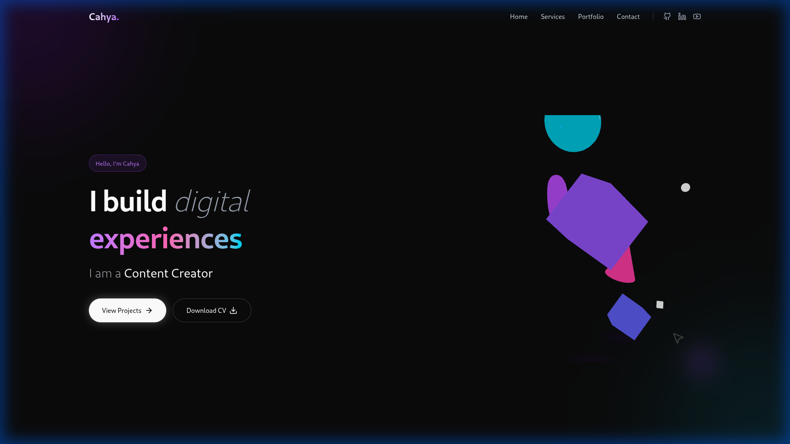

# Portfolio

Welcome to my personal portfolio website!



## 🚀 Getting Started

Follow these steps to run the project locally.

### Prerequisites

- Node.js (v18 or higher recommended)
- npm (usually comes with Node.js)

### Installation

1.  **Clone the repository:**
    ```bash
    git clone https://github.com/gede-cahya/porfolionew.git
    cd porfolionew
    ```

2.  **Install dependencies:**
    ```bash
    npm install
    ```

### Running Locally

To start the development server:
```bash
npm run dev
```
Open [http://localhost:5173](http://localhost:5173) in your browser to view the portfolio.

### Building for Production

To build the project for deployment:
```bash
npm run build
```
The build artifacts will be stored in the `dist/` directory.

## 🛠️ Technologies Used

- React
- Tailwind CSS
- Vite
- Framer Motion
